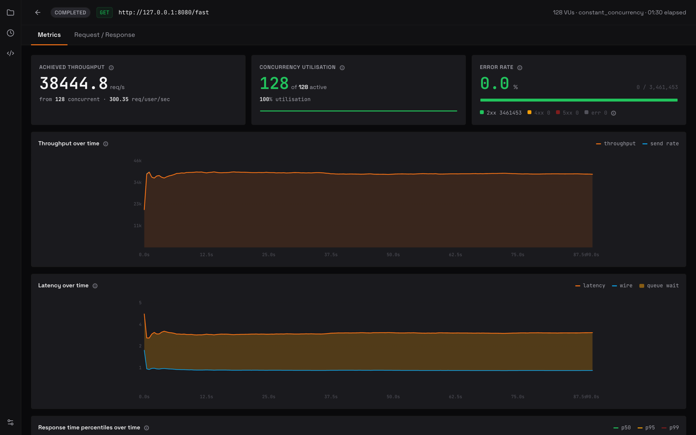
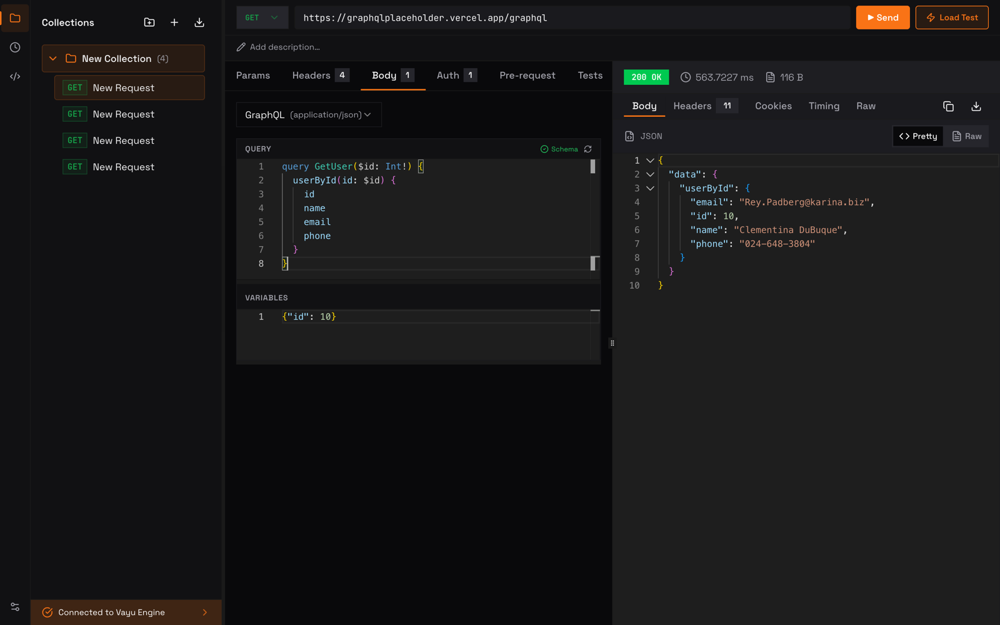

# Vayu - REST/GraphQL Client and Native Load Tester, in One Desktop App

**Build a request like you do in Postman. Load test the same endpoint at tens of thousands of requests per second - driven by a native C++ engine. Fully local. No account, no cloud, no quotas.**

Vayu is a free, open source desktop app for Windows, macOS, and Linux that merges two tools API teams normally split: a full REST + GraphQL request builder with collections, environments, and scripting, and a high-throughput load tester powered by a C++20 engine. The request UI will feel familiar coming from Postman or Insomnia - but underneath, a native event loop pushes load-test throughput that Electron + Node.js clients cannot reach, with every byte staying on your machine.

[](https://github.com/athrvk/vayu/releases/latest)
[](https://github.com/athrvk/vayu/releases)
[](LICENSE)
[](https://github.com/athrvk/vayu/releases)
[](https://github.com/athrvk/vayu)
[](https://github.com/athrvk/vayu/issues)


---

## See it in action


*The load-test dashboard. Throughput, latency percentiles, and error counters stream live from the C++ engine while the UI stays responsive.*


*REST and GraphQL request builder with collections, layered environments, and Postman-compatible scripting.*

---

## Why Vayu exists

Most API teams run two tools side by side. Postman, Bruno, or Insomnia to build and send requests during development. k6, JMeter, or wrk when it is time to load test. Two UIs, two config formats, two places to keep endpoints in sync - and a context switch every time you want to confirm a change still holds under real traffic.

Vayu collapses that workflow into one app. Build a request once, point the load tester at the same endpoint, and watch a live dashboard while the engine drives traffic - no second config, no separate CLI, no leaving the workspace. Because the entire stack runs on your machine with no account, no telemetry, and no cloud round-trips, it also works behind corporate firewalls and on air-gapped networks where SaaS clients simply cannot.

---

## Performance

The HTTP core is a multi-worker libcurl event loop in C++20, isolated from the Electron UI by a local HTTP sidecar so rendering never blocks on the request load. In practice that lets a single laptop saturate a gigabit link while the dashboard keeps streaming metrics frame-by-frame - well past what Node.js-backed Electron tools manage on the same hardware.

**Proof - head-to-head vs `wrk` and `vegeta`.** Same mock server, same machine, matched concurrency, measured from the CLI:

| Client | req/s @ 128 conns |
|---|---:|
| wrk | 56,802 |
| vegeta | 53,811 |
| **Vayu** | **52,825** |

Vayu lands at **~93% of wrk and on par with vegeta** (and edges past vegeta at 256 connections) - all three converge on the same system throughput ceiling. Full methodology, the concurrency sweep, tuning notes, and a one-command reproduction script are in **[Engine Benchmarks](docs/engine/benchmarks.md)**.

A broader comparison against k6, JMeter, and the Postman collection runner is in progress - follow [the issues board](https://github.com/athrvk/vayu/issues) to track it.

---

## Vayu vs. Postman, Bruno, k6, JMeter

| Feature | Vayu | Bruno | k6 | Apache JMeter | Postman |
|---|---|---|---|---|---|
| **Execution Engine** | C++ (Native) | Node.js / Electron | Go | Java (JVM) | Node.js / Electron |
| **API Client + Load Test** | Both, one app | Client only | Load test only | Load test only | Client only |
| **Load Test Throughput** | Tens of thousands RPS | Limited by JS runtime | High (Go routines) | Moderate (thread-heavy) | Requires separate tool |
| **Scripting** | QuickJS (`pm.*` syntax) | JavaScript (ES6) | JavaScript (ES6) | Groovy / BeanShell | JavaScript |
| **UI** | Native desktop app | Native desktop app | CLI only | Java Swing (dated) | Native desktop app |
| **UI Responsiveness** | High (sidecar arch) | Good | N/A | Laggy under load | Slows with large collections |
| **Memory Usage** | Low (direct memory) | Low–Moderate | Low–Moderate | High (RAM-intensive) | High (Electron + Chrome) |
| **Privacy / Offline** | 100% local, no account | 100% local | Local / cloud hybrid | 100% local | Cloud-heavy (optional local) |
| **Postman Collection Import** | Yes (v2.0 + v2.1) | Yes (via converter) | Limited | No | Native |
| **OpenAPI Import** | Yes (2.0 + 3.0) | No | No | No | Yes |
| **Open Source** | Yes (dual-license) | Yes (MIT) | Yes (AGPL v3) | Yes (Apache 2.0) | Partial |

---

## Coming from Postman, Insomnia, or an OpenAPI spec?

Migrating takes seconds. Drop an existing export onto Vayu and the workspace is rebuilt as a native collection - folders, environments, variables, auth, and pre/post-request scripts all carry across.

- **Postman** - Collection v2.0 and v2.1 JSON exports
- **Insomnia** - v4 exports
- **OpenAPI / Swagger** - 3.0 and 2.0 specs (JSON or YAML); generates a ready-to-use collection from the spec

---

## Features

- **Native load testing** - multi-worker C++ event loop sustains tens of thousands of req/s with metrics streamed over SSE in real time; no second tool needed
- **REST + GraphQL request builder** - GET, POST, PUT, PATCH, DELETE and more; JSON, form-data, URL-encoded, raw text, and GraphQL bodies
- **Collections & folder hierarchy** - nested collections with per-collection variables, auth, and pre/post scripts
- **One-drop import** - Postman v2.0/v2.1, Insomnia v4, OpenAPI 3.0, Swagger 2.0
- **Layered environments** - variable resolution flows from globals → collection chain → active environment, with overrides at any level
- **Auth, the way you expect it** - Bearer token, Basic auth, API key (header or query), and OAuth 2.0 (client credentials, password, and interactive authorization code with PKCE); resolved engine-side and inherits down the collection tree
- **Postman-compatible test scripts** - QuickJS engine implementing `pm.test()`, `pm.expect()`, `pm.environment.set()`, `pm.response.*` - most Postman scripts run unmodified
- **Composable scripting** - pre/post-request scripts compose down the hierarchy (root → folder → request)
- **Private by default** - 100% offline execution; no telemetry, no account, no cloud sync
- **Cross-platform** - native installers for Windows (x64), macOS (universal), and Linux (AppImage)

---

## Download

### Windows

Install with [winget](https://learn.microsoft.com/windows/package-manager/winget/):

```powershell
winget install athrvk.Vayu
```

Or download the installer directly:

1. Download [Vayu-x64.exe](https://github.com/athrvk/vayu/releases/latest/download/Vayu-x64.exe)
2. Run the installer and follow the setup wizard
3. Launch **Vayu** from the Start menu

### macOS

```sh
/bin/bash -c "$(curl -fsSL https://raw.githubusercontent.com/athrvk/vayu/master/install.sh)"
```

Installs the latest release to `/Applications`. You will be prompted for your password once. Vayu is distributed unsigned - the installer ad-hoc signs it and clears the quarantine flag so it opens without the "damaged app" warning.

To pin a specific version:

```sh
VAYU_VERSION=0.2.1 /bin/bash -c "$(curl -fsSL https://raw.githubusercontent.com/athrvk/vayu/master/install.sh)"
```

To uninstall:

```sh
/bin/bash -c "$(curl -fsSL https://raw.githubusercontent.com/athrvk/vayu/master/install.sh)" -- --uninstall
```

Add `--purge` to also remove settings and data. Or drag `Vayu.app` from `/Applications` to the Trash.

### Linux

1. Download [Vayu-x86_64.AppImage](https://github.com/athrvk/vayu/releases/latest/download/Vayu-x86_64.AppImage)
2. Make it executable:
   ```sh
   chmod +x Vayu-x86_64.AppImage
   ```
3. Run it:
   ```sh
   ./Vayu-x86_64.AppImage
   ```

No installation wizard or root access required. The AppImage is self-contained.

[View all releases →](https://github.com/athrvk/vayu/releases)

---

## Architecture

Vayu runs as two cooperating processes: a lightweight Electron UI (the Manager) and a native C++ daemon (the Engine) sitting next to it as a local sidecar. The Manager owns the workspace - collections, environments, the request builder, the dashboard - and the Engine owns the wire: connection pooling, the event loop, script execution, and metrics. Keeping them split is what lets the UI stay smooth while the engine is hammering an endpoint at full tilt; the renderer never has to share a thread with the request load.

```
┌────────────────────┐         ┌────────────────────┐
│   THE MANAGER      │  local  │    THE ENGINE      │
│  (Electron/React)  │◄───────►│      (C++)         │
│                    │ sidecar │                    │
│  • Request Builder │         │  • Event Loop      │
│  • Collections     │         │  • QuickJS Runtime │
│  • Load Dashboard  │         │  • Multi-Worker    │
└────────────────────┘         └────────────────────┘
```

See [Architecture Documentation](docs/architecture.md) for the full process model and IPC details.

---

## Tech Stack

| Layer | Technology |
|---|---|
| UI | Electron + React 19 + TypeScript 5 |
| UI state | Zustand |
| Server state | TanStack Query |
| Styling | Tailwind CSS v4 |
| HTTP engine | C++20 + libcurl |
| Scripting | QuickJS (embedded JS engine) |
| Database | SQLite via sqlite_orm |
| Build | CMake + vcpkg (C++), pnpm + Vite (app) |

---

## Documentation

| Document | Description |
|---|---|
| [Architecture](docs/architecture.md) | Sidecar pattern, process model, IPC |
| [Engine API Reference](docs/engine/api-reference.md) | Full HTTP API for the C++ engine |
| [Engine Benchmarks](docs/engine/benchmarks.md) | RPS head-to-head vs wrk and vegeta - methodology, results, and tuning |
| [DB Schema](docs/engine/db-schema.md) | SQLite table definitions and JSON shapes |
| [Variable Resolution](docs/app/variable-resolution.md) | How `{{variables}}` resolve at runtime |
| [Building from Source](docs/building.md) | Prerequisites, CMake presets, all build commands |
| [Contributing](CONTRIBUTING.md) | Dev setup, code style, PR process |

---

## Contributing

Contributions are welcome - from bug reports and feature ideas to documentation and code. The [Contributing Guide](CONTRIBUTING.md) covers local dev setup, code style, testing requirements, the PR process, and the release/versioning workflow.

---

## FAQ

**Is Vayu free?**
Yes. Vayu is fully free and open source. The engine is licensed AGPL-3.0; the UI is Apache-2.0. There is no paid tier, no subscription, and no feature gating.

**What makes Vayu different from Bruno or Insomnia?**
Those are excellent API clients, but they do not load test - for that, you reach for k6 or JMeter as a second tool. Vayu does both in one app: build the request, then load test the same endpoint with a native C++ engine.

**How fast is the load testing?**
The C++ engine sustains tens of thousands of requests per second on modern hardware; see the [Performance](#performance) section. Exact numbers depend on your machine, the target server, and network conditions.

**Does Vayu work offline?**
Yes. All execution happens locally. Vayu never contacts external servers during normal use - no telemetry, no license checks, no cloud sync.

**Does Vayu require an account?**
No. Download, install, and use it immediately with no sign-up.

**Can I import my Postman collections?**
Yes - Postman Collection v2.0 and v2.1 JSON exports, including folders, environments, variables, auth settings, and pre/post-request scripts.

**Can I import OpenAPI / Swagger specs?**
Yes. Drop in an OpenAPI 3.0 or Swagger 2.0 file (JSON or YAML) and Vayu generates a ready-to-use collection from the spec.

**What scripting syntax does Vayu support?**
QuickJS implementing the `pm.*` API (`pm.test()`, `pm.expect()`, `pm.environment.get/set()`, `pm.response.*`), so most Postman test scripts run without modification.

**Which platforms does Vayu support?**
Windows (x64), macOS (Apple Silicon + Intel universal), and Linux (x86_64 AppImage).

---

## License

Vayu is dual-licensed:

- **Engine (`/engine`)** - [GNU AGPL v3](https://www.gnu.org/licenses/agpl-3.0.html): if you modify the engine and offer it as a network service, you must publish your changes.
- **UI (`/app`)** - [Apache 2.0](https://www.apache.org/licenses/LICENSE-2.0): permissive; use freely in any project.

You are free to use Vayu for any purpose, commercial or personal, at no cost.
