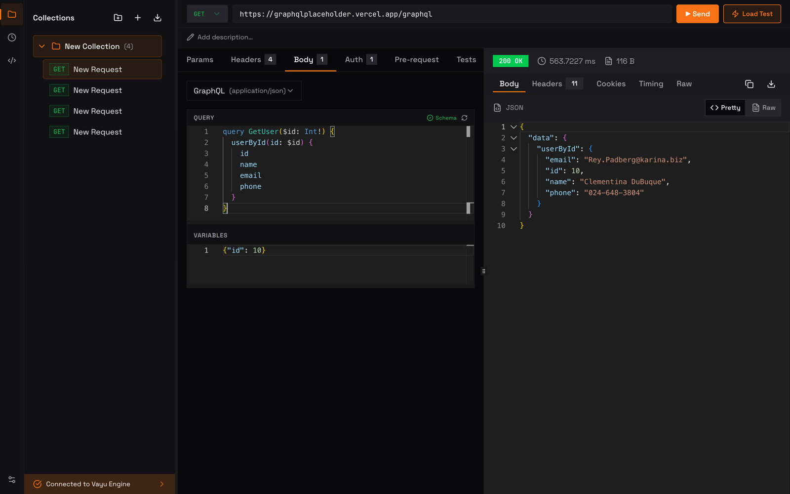

# Vayu - Open Source API Client and Native Load Tester in One Desktop App

**Vayu is a free, open source API client with a native C++ load engine - build requests like Postman, load test the same endpoint at 50k+ req/s, and let your coding agent drive all of it over MCP. One app, fully local, no account.**

- **50k+ req/s from the app's own UI** - 56,880 standalone, matching `wrk` and edging past `vegeta` on the same machine
- **Most Postman scripts run unmodified** - a QuickJS runtime implementing the `pm.*` API
- **MCP server built in** - Claude Code, Cursor, VS Code, Codex and Zed drive the same engine the UI does

[](https://github.com/athrvk/vayu/releases/latest)
[](https://github.com/athrvk/vayu/releases)
[](LICENSE)
[](https://github.com/athrvk/vayu/releases)

---

## See it in action

<!-- The lead asset here should MOVE: a <30s GIF/MP4 of build request -> send ->
     flip to load test -> dashboard streaming at 50k req/s. The owner records it;
     drop it in as docs/images/vayu-demo.gif above the two stills below and the
     section is done. Structure is deliberately GIF-ready. -->


*The load-test dashboard: 52,738 req/s at concurrency 64, 738,406 requests, 100% success. Throughput, latency percentiles, and error counters stream live from the C++ engine while the UI stays responsive, with every run kept in the history sidebar.*


*REST and GraphQL request builder with collections, layered environments, and Postman-compatible scripting.*

---

## Why Vayu exists

Most API teams run two tools side by side. Postman, Bruno, or Insomnia to build and send requests during development. k6, JMeter, or wrk when it is time to load test. Two UIs, two config formats, two places to keep endpoints in sync - and a context switch every time you want to confirm a change still holds under real traffic.

Vayu collapses that workflow into one app. Build a request once, point the load tester at the same endpoint, and watch a live dashboard while the engine drives traffic - no second config, no separate CLI, no leaving the workspace. And when your coding agent needs to test what it just built, it drives the same engine over MCP - no browser automation, no copy-pasted curl. Because the entire stack runs on your machine with no account, no telemetry, and no cloud round-trips, it also works behind corporate firewalls and on air-gapped networks where SaaS clients simply cannot.

---

## Performance

The HTTP core is a multi-worker libcurl event loop in C++23, isolated from the Electron UI by a local HTTP sidecar so rendering never blocks on the request load. In practice that lets a single laptop saturate a gigabit link while the dashboard keeps streaming metrics frame-by-frame - well past what Node.js-backed Electron tools manage on the same hardware.

**Proof - head-to-head vs `wrk` and `vegeta`.** Same mock server, same machine, same session, matched concurrency (64), measured from a standalone engine:

| Client | req/s | vs wrk |
|---|---:|:---:|
| **Vayu** | **56,880** | **105%** |
| wrk | 54,280 | 100% |
| vegeta | 51,847 | 96% |

Vayu **matches `wrk` and edges past `vegeta`** - all three converge on the same ~57k system throughput ceiling, and at that ceiling the machine is still 79% idle, so it is the target saturating, not the client. Full methodology, the concurrency sweep, the `workers` A/B, tuning notes, and a one-command reproduction script are in **[Engine Benchmarks](https://athrvk.github.io/vayu/engine/benchmarks/)**.

**And from the UI, not just the CLI.** A 60-second run started from the app's own Load Test panel sustained **51,922 req/s - 3,115,391 requests, zero errors, zero dropped**, p50 1.20 ms / p99 1.52 ms, with the charts streaming live throughout:


---

## Vayu vs. Postman, Bruno, k6, JMeter

| Feature | Vayu | Bruno | k6 | Apache JMeter | Postman |
|---|---|---|---|---|---|
| **Execution Engine** | C++ (Native) | Node.js / Electron | Go | Java (JVM) | Node.js / Electron |
| **API Client + Load Test** | Both, one app | Client only | Load test only | Load test only | Client only |
| **Load Test Throughput** | Tens of thousands RPS | Limited by JS runtime | High (Go routines) | Moderate (thread-heavy) | Requires separate tool |
| **Scripting** | QuickJS (`pm.*` syntax) | JavaScript (ES6) | JavaScript (ES6) | Groovy / BeanShell | JavaScript |
| **UI** | Native desktop app | Native desktop app | CLI only | Java Swing (dated) | Native desktop app |
| **UI Responsiveness** | High (sidecar arch) | Good | N/A | Laggy under load | Slows with large collections |
| **Memory Usage** | Low (direct memory) | Low–Moderate | Low–Moderate | High (RAM-intensive) | High (Electron + Chrome) |
| **Privacy / Offline** | 100% local, no account | 100% local | Local / cloud hybrid | 100% local | Cloud-heavy (optional local) |
| **MCP / agent control** | Built in, local, drives the load engine | Official server, wraps the CLI | Official server (experimental) | No | Yes, via the cloud workspace |
| **SSE streaming** | Live Events view, scriptable, load-tested | Connects, no event UI | Via extension | No | Client-side inspection |
| **Mock servers** | Collection mock + OAuth issuer + webhook inbox | No | No | No | Yes (cloud tier) |
| **Data-driven runs** | CSV / TSV / JSON / JSONL | CSV / JSON | Yes (in script) | CSV | CSV / JSON |
| **Postman Collection Import** | Yes (v2.0 + v2.1) | Yes (via converter) | Limited | No | Native |
| **OpenAPI Import** | Yes (2.0 / 3.0 / 3.1) | No | No | No | Yes |
| **Open Source** | Yes (dual-license) | Yes (MIT) | Yes (AGPL v3) | Yes (Apache 2.0) | Partial |

---

## Coming from Postman, Insomnia, or an OpenAPI spec?

Migrating takes seconds. Drop an existing export onto Vayu and the workspace is rebuilt as a native collection - folders, variables, auth, and pre/post-request scripts all carry across, plus environments - from an Insomnia workspace, or from the separate file Postman exports them as.

- **Postman** - Collection v2.0 and v2.1 JSON exports, plus environment and globals exports
- **Insomnia** - v4 exports
- **OpenAPI / Swagger** - 3.1, 3.0 and 2.0 specs (JSON or YAML); generates a ready-to-use collection from the spec

---

## Features

- **Native load testing** - multi-worker C++ event loop sustains tens of thousands of req/s with metrics streamed over SSE in real time; no second tool needed
- **REST + GraphQL request builder** - GET, POST, PUT, PATCH, DELETE and more; JSON, XML, JSON-RPC, form-data, URL-encoded, raw text, and GraphQL bodies
- **SSE / streaming requests** - consume `text/event-stream` endpoints as a first-class request type, with a live Events view, a Stop control, and the event list restored from history
- **Collections & folder hierarchy** - nested collections with per-collection variables, auth, and pre/post scripts
- **Scenario collection runs** - run a collection as an ordered scenario, in design mode or under load, with per-step results and threshold verdicts
- **Data-driven runs** - drive a collection from a CSV, TSV, JSON or JSONL file; columns arrive as `{{data.column}}` tokens and `pm.iterationData`, declared up front on the collection's Data tab
- **One-drop import** - Postman v2.0/v2.1, Postman environments and globals, Insomnia v4, OpenAPI 3.1/3.0, Swagger 2.0
- **Saved response examples** - capture a real response against a request and keep it as a named example
- **Mock servers** - serve a collection's saved examples as a live mock, plus a mock OAuth issuer for auth flows and a webhook inbox that captures inbound calls
- **MCP server for coding agents** - 24 typed tools over inspection, execution, load runs and writes, behind a host allowlist, load caps, and a write toggle that ships off
- **Layered environments** - variable resolution flows from globals → collection chain → active environment, with overrides at any level
- **Auth, the way you expect it** - Bearer token, Basic auth, API key (header or query), and OAuth 2.0 (client credentials, password, and interactive authorization code with PKCE); resolved engine-side and inherits down the collection tree
- **Postman-compatible test scripts** - QuickJS engine implementing `pm.test()`, `pm.expect()`, `pm.environment.set()`, `pm.response.*` - most Postman scripts run unmodified
- **Composable scripting** - pre/post-request scripts compose down the hierarchy (root → folder → request)
- **Command palette + deep search** - one shortcut to jump to any collection, request, environment or setting, searching inside them rather than just their names
- **Private by default** - 100% offline execution; no telemetry, no account, no cloud sync
- **Cross-platform** - native installers for Windows (x64), macOS (universal), and Linux (AppImage)

---

## Install

Windows (x64), macOS 13+ (universal), and Linux (AppImage). No account, no sign-in.

**Windows** - [winget](https://learn.microsoft.com/windows/package-manager/winget/), or the [installer](https://github.com/athrvk/vayu/releases/latest/download/Vayu-x64.exe):

```powershell
winget install athrvk.Vayu
```

**macOS** and **Linux** - the same command on both:

```sh
bash -c "$(curl -fsSL https://athrvk.github.io/vayu/install.sh)"
```

Re-run it to update. Full detail per platform - what the script does and why, pinning a version, uninstalling, the AppImage route, FUSE 2 on Linux - is on the site:
**[Install Vayu →](https://athrvk.github.io/vayu/#install)**

[View all releases →](https://github.com/athrvk/vayu/releases)

---

## Architecture

Vayu runs as two cooperating processes: a lightweight Electron UI (the Manager) and a native C++ daemon (the Engine) sitting next to it as a local sidecar. The Manager owns the workspace - collections, environments, the request builder, the dashboard - and the Engine owns the wire: connection pooling, the event loop, script execution, and metrics. Keeping them split is what lets the UI stay smooth while the engine is hammering an endpoint at full tilt; the renderer never has to share a thread with the request load.

```
┌────────────────────┐         ┌────────────────────┐
│   THE MANAGER      │  local  │    THE ENGINE      │
│  (Electron/React)  │◄───────►│      (C++)         │
│                    │ sidecar │                    │
│  • Request Builder │         │  • Event Loop      │
│  • Collections     │         │  • QuickJS Runtime │
│  • Load Dashboard  │         │  • Multi-Worker    │
└────────────────────┘         └────────────────────┘
```

See [Architecture Documentation](https://athrvk.github.io/vayu/architecture/) for the full process model and IPC details.

| Layer | Technology |
|---|---|
| UI | Electron + React 19 + TypeScript 7 |
| UI state | Zustand |
| Server state | TanStack Query |
| Styling | Tailwind CSS v4 |
| HTTP engine | C++23 + libcurl |
| Scripting | QuickJS (embedded JS engine) |
| Database | SQLite via sqlite_orm |
| Build | CMake + vcpkg (C++), pnpm + Vite (app) |

---

## Documentation

**Full docs: [athrvk.github.io/vayu](https://athrvk.github.io/vayu/)** - searchable, and built from `docs/` on every push to `master`.

| Document | Description |
|---|---|
| [Architecture](https://athrvk.github.io/vayu/architecture/) | Sidecar pattern, process model, IPC |
| [Engine API Reference](https://athrvk.github.io/vayu/engine/api-reference/) | Full HTTP API for the C++ engine |
| [Engine Benchmarks](https://athrvk.github.io/vayu/engine/benchmarks/) | RPS head-to-head vs wrk and vegeta - methodology, results, and tuning |
| [MCP Server](https://athrvk.github.io/vayu/engine/mcp/) | The tool surface exposed to coding agents, and how to register it |
| [Test Scripting](https://athrvk.github.io/vayu/engine/scripting/) | The QuickJS sandbox, script globals, hooks, limits |
| [Data-Driven Runs](https://athrvk.github.io/vayu/app/data-driven-runs/) | Driving a collection from CSV, TSV, JSON or JSONL |
| [DB Schema](https://athrvk.github.io/vayu/engine/db-schema/) | SQLite table definitions and JSON shapes |
| [Variable Resolution](https://athrvk.github.io/vayu/app/variable-resolution/) | How `{{variables}}` resolve at runtime |
| [Importing Collections](https://athrvk.github.io/vayu/app/import-collections/) | The import pipeline, format by format |
| [Building from Source](https://athrvk.github.io/vayu/building/) | Prerequisites, CMake presets, all build commands |
| [Contributing](CONTRIBUTING.md) | Dev setup, code style, PR process |

---

## Contributing

Contributions are welcome - from bug reports and feature ideas to documentation and code. The [Contributing Guide](CONTRIBUTING.md) covers local dev setup, code style, testing requirements, the PR process, and the release/versioning workflow.

---

## FAQ

**Is Vayu free?**
Yes. Vayu is fully free and open source. The engine is licensed AGPL-3.0; the UI is Apache-2.0. There is no paid tier, no subscription, and no feature gating.

**What makes Vayu different from Bruno or Insomnia?**
Those are excellent API clients, but they do not load test - for that, you reach for k6 or JMeter as a second tool. Vayu does both in one app: build the request, then load test the same endpoint with a native C++ engine.

**How fast is the load testing?**
The C++ engine sustains tens of thousands of requests per second on modern hardware; see the [Performance](#performance) section. Exact numbers depend on your machine, the target server, and network conditions.

**Can my coding agent use Vayu?**
Yes. Vayu ships an MCP server inside the app on `127.0.0.1:9877`, and one command registers it with Claude Code, Cursor, VS Code, Codex or Zed. The agent gets 24 typed tools - inspection (`list_collections`, `get_run_report`, `compare_runs`), execution (`run_request`, `run_collection_smoke`), load runs (`start_load_run`, `stop_run`) and writes over collections, requests and environments. Because an agent pointed at your engine is a real capability, it is gated: network tools refuse any host outside an allowlist that starts empty, load runs are capped on RPS, concurrency and duration, and the tools that mutate saved data sit behind a write toggle that ships off. Nothing leaves the machine.

**Does Vayu support SSE / streaming endpoints?**
Yes. Turn on Event stream for a request and Vayu consumes `text/event-stream` as a first-class request type: events arrive in a live Events tab as they stream, you can stop the stream yourself, scripts can assert on the buffered events after it closes, and the event list is restored when you reopen the run from history. Streams are bounded under load rather than buffering without limit.

**Does Vayu work offline?**
Yes. All execution happens locally. Vayu never contacts external servers during normal use - no telemetry, no license checks, no cloud sync.

**Does Vayu require an account?**
No. Download, install, and use it immediately with no sign-up.

**Can I import my Postman collections?**
Yes - Postman Collection v2.0 and v2.1 JSON exports, including folders, collection variables, auth settings, and pre/post-request scripts. Postman environments live in a separate export file; drop that in too and it imports as a Vayu environment. A Postman globals export imports the same way, merging into Vayu's globals scope. Insomnia workspace environments import as well.

**Can I import OpenAPI / Swagger specs?**
Yes. Drop in an OpenAPI 3.1, OpenAPI 3.0 or Swagger 2.0 file (JSON or YAML) and Vayu generates a ready-to-use collection from the spec.

**What scripting syntax does Vayu support?**
QuickJS implementing the `pm.*` API (`pm.test()`, `pm.expect()`, `pm.environment.get/set()`, `pm.response.*`), so most Postman test scripts run without modification.

**Which platforms does Vayu support?**
Windows (x64), macOS 13 (Ventura) or later (Apple Silicon + Intel universal), and Linux
(x86_64 AppImage).

---

## License

Vayu is dual-licensed:

- **Engine (`/engine`)** - [GNU AGPL v3](https://www.gnu.org/licenses/agpl-3.0.html): if you modify the engine and offer it as a network service, you must publish your changes.
- **UI (`/app`)** - [Apache 2.0](https://www.apache.org/licenses/LICENSE-2.0): permissive; use freely in any project.

You are free to use Vayu for any purpose, commercial or personal, at no cost.
