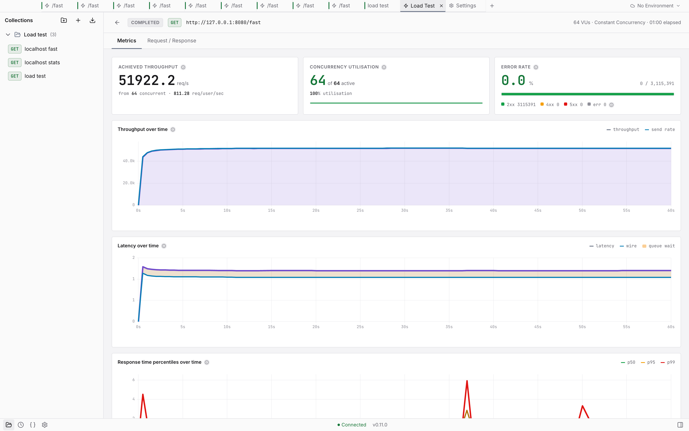

# Engine Benchmarks - Vayu vs wrk vs vegeta

How fast is Vayu's load-test engine relative to the established native load
testers? This page documents a head-to-head against
[`wrk`](https://github.com/wg/wrk) and [`vegeta`](https://github.com/tsenart/vegeta),
the methodology, and how to reproduce it.

**TL;DR - Vayu is in the same performance class as wrk and vegeta.** On a
standalone engine, tuned, it reached **56,880 req/s** against a loopback mock -
**104.8% of `wrk` measured on the same machine in the same session** (54,280) -
with every client converging on the same **~57k system ceiling**. Driven from the
app's own UI, a 60 s run sustained **51,922 req/s / 3.1 M requests with zero
errors**. The dominant tuning lever is not an engine knob at all: it is the run's
own **`concurrency`**, and the optimum on this target is **64**.

## Methodology

- **All three clients hit the same mock server** (`scripts/test/mock-server.go`,
  `:8080`, `/fast` endpoint - an 11-byte response with ~1 µs handler latency),
  so the comparison is apples-to-apples. Endpoint choice does not move the
  number (`wrk`: `/` 54,096, `/fast` 53,994, `/string` 54,471 req/s), so neither
  the response body nor the per-handler work is the limiter.
- **Peak numbers come from a standalone engine daemon**, not from the app.
  Running through the app costs a **measured ~9%** on this machine (see
  [The app-engine gap](#the-app-engine-gap)). The UI is for *driving and
  visualising* tests; the standalone daemon is for measuring peak engine RPS.
- **Matched concurrency.** wrk holds `-c` connections, vegeta runs
  `-rate=N -max-workers=N` (open-loop), Vayu runs closed-loop
  constant-concurrency (`concurrency=N`, no target rate). 10-20 s per run for
  the sweeps, 60 s for headline figures, with cooldowns between runs.
- All runs are **error-free** (0 non-2xx, 0 failures, 0 dropped) - across roughly
  23 M requests through Vayu in the 2026-07-29 session alone.

### Hardware

MacBook Pro **M3 Pro, 18 GB**, macOS. 12 cores = **6 performance + 6 efficiency**
(no SMT). This asymmetry matters: macOS assigns threads to P- vs E-cores by QoS
class, and on a single machine the load-test *client and the mock server share
the same 12 cores* - so the measured ceiling (~57k RPS for a trivial request) is
a **shared system limit**, not any one client's ceiling. `ulimit -n` was
1,048,576 and never a constraint.

## Results (2026-07-29, engine 0.11.0)

### Headline

| | req/s | vs `wrk` |
|---|---:|:---:|
| **Vayu, standalone engine** (c=64, workers=8, verbose 1) | **56,880** | **104.8%** |
| `wrk` (`-t6 -c64 -d10s`) | 54,280 | 100% |
| `vegeta` (`-rate=90000 -max-workers=400`, achieved) | 51,847 | 95.5% |
| Vayu, through the app's engine (c=64, 30 s) | 52,028 | 95.9% |
| **Vayu, started from the app UI** (c=64, 60 s) | **51,922** | 95.7% |

The `wrk` figure here (54,280) was measured with the app and its engine alive in
the background; an earlier sweep on a quieter machine put `wrk` at 56,649. Read
the ratio, not the absolute: **all clients land between 52k and 57k, and Vayu
sits at the top of that band when measured the same way `wrk` is.**

### Reference clients

| Client | Configuration | Result |
|---|---|---|
| `wrk` | `-t6 -c64 -d10s` | **54,280 req/s**, p50 1.10 ms, p99 1.21 ms |
| `wrk` | `-t6 -c128 -d8s` | 54,138 req/s, p50 2.32 ms |
| `wrk` | `-t6 -c256 -d8s` | 53,059 req/s, p50 4.70 ms |
| `vegeta` | `-rate=90000 -max-workers=400 -duration=8s` | 51,847 achieved of 90,000 requested, 100% success, mean 7.66 ms |

### Concurrency sweep (app engine, workers=12, 9 s per point)

| concurrency | 32 | 64 | 128 | 192 | 256 |
|---|---:|---:|---:|---:|---:|
| throughput | 51,215 | **52,158** | 51,986 | 51,398 | 49,516 |
| p50 (ms) | 0.60 | 1.13 | 2.25 | 3.44 | 4.59 |
| p95 (ms) | 0.75 | 1.52 | 3.40 | 5.34 | 9.54 |
| p99 (ms) | 0.93 | 2.90 | 9.01 | 10.78 | 23.18 |
| errors / dropped | 0 / 0 | 0 / 0 | 0 / 0 | 0 / 0 | 0 / 0 |

Peak is a broad plateau across c=32-192 that degrades past 256. Latency scales
almost exactly linearly with concurrency while throughput stays pinned - the
signature of a saturated *target*, not a client running out of capacity. Neither
side is CPU-bound at that point: sampled mid-run at 52,738 req/s, the system was
**79% idle** (~2.5 of 12 cores busy).

**Concurrency is the single largest lever, and over-driving costs more than any
engine knob returns:**

| | c=400 | c=64 | change |
|---|---:|---:|---|
| throughput | 44,299 | 52,028 | **+17.4%** |
| p50 | 7.28 ms | 1.19 ms | 6x better |
| p99 | 59.90 ms | 1.57 ms | **38x better** |
| p999 | 307.46 ms | - | gone |

### `workers` A/B: 8 vs 12

Interleaved A/B/A/B/A/B on a standalone engine to control for drift, 3 reps per
arm, c=64, 20 s per run, `--verbose 0`. No restarts - `workers` is read per run.

| rep | workers | throughput | p50 | p95 | p99 | OS threads mid-run |
|---:|---:|---:|---:|---:|---:|---:|
| 1 | 12 | 56,201 | 0.96 | 2.21 | 4.39 | 29 |
| 1 | 8 | 54,458 | 1.07 | 1.44 | 3.44 | 25 |
| 2 | 12 | 55,885 | 0.94 | 2.33 | 4.86 | 29 |
| 2 | 8 | 56,849 | 1.08 | 1.35 | 1.86 | 25 |
| 3 | 12 | 55,960 | 0.94 | 2.31 | 4.65 | 29 |
| 3 | 8 | 56,587 | 1.08 | 1.37 | 2.15 | 25 |

| metric | workers=12 | workers=8 | winner |
|---|---:|---:|---|
| mean throughput | 56,015 | 55,965 | tie (0.09% apart) |
| mean p50 | 0.947 ms | 1.077 ms | 12, by 0.13 ms |
| mean p95 | 2.28 ms | 1.387 ms | **8**, by 39% |
| mean p99 | 4.63 ms | 2.48 ms | **8**, by 46% |

**Throughput is a statistical tie; the tail is not.** 12 workers give a slightly
better median and a distinctly worse tail, consistently across every rep. The
plausible mechanism is that 12 event-loop threads spill onto the 6 efficiency
cores and work landing on an E-core lands in the tail; 8 threads fit the 6
performance cores far more closely. **`workers = 8` is the recommendation, for
tail latency rather than throughput.**

Two things this A/B did *not* reproduce, both worth noting against the older
numbers below: there was **no throughput collapse at `workers = ncpu`** (12 tied
with 8 and never dipped), and `workers = 8` was never faster than 12 by more than
noise. The `workers=8` spread is inflated entirely by its rep 1 (54,458), the
first run after a config change - excluding it the mean is 56,718.

### Verbose logging costs nothing measurable

Same standalone instance, `workers = 8`, restarted with `--verbose 1`:

| rep | throughput | p50 | p95 | p99 |
|---:|---:|---:|---:|---:|
| 1 | 56,652 | 1.09 | 1.31 | 1.70 |
| 2 | **56,880** | 1.08 | 1.32 | 1.78 |
| 3 | 56,773 | 1.06 | 1.45 | 3.12 |

Mean **56,768 with verbose on** versus 55,965 off. The shipped app always runs
the engine at `--verbose 1` (`app/electron/sidecar.ts`), which sets
`CURLOPT_VERBOSE` on the load path - so this was expected to be the biggest
available win, and it is not one. Keep-alive means libcurl emits few debug
events once connections are established, and the log grew only 5,256 bytes
across 3.4 M requests. Gating the debug callback on log level remains worthwhile
hygiene; it is not a performance lever.

### Per-phase histograms cost under 2% (2026-08-11, engine 0.15.0)

`phaseHistograms` (issue #476) adds **five `hdr_record_value_atomic` calls per
successful completion** - the DNS/connect/TLS/first-byte/download bank behind
the report's `timingBreakdown.phases`. It defaults **on**, and this is the
measurement that decides that.

**Different hardware from every other figure on this page.** Measured on a
4-core Linux container, not the M3 Pro, with the mock server sharing those same
4 cores - so the ceiling is **~18.9k req/s**, a third of the M3 Pro's. Read the
A/B ratio, not the absolute numbers.

Same daemon, same target, same run config; only the run's own
`phase_histograms` override differs, so no restart separates the arms.
`constant_concurrency` 64, 20 s per run, 4 s cooldown, 19 runs per arm - 14
with ON first in each pair and 5 with the order reversed, because a fixed
within-pair order would let any drift land entirely on one arm.

| statistic | ON | OFF | delta |
|---|---:|---:|---:|
| median req/s | 18,578 | 18,869 | **-1.54%** |
| mean req/s | 18,242 | 18,694 | -2.42% |
| mean, lowest run per arm dropped | - | - | -1.78% |

The raw mean is the only figure past 2%, and one run does all of that work: a
single ON rep landed at 14,641 req/s, 21% under the next-lowest run in either
arm. Per-arm spread is 12-25%, so a 1.5% difference is at the edge of what this
box resolves at all - and the two orderings disagree in size (-1.83% ON-first,
-0.97% OFF-first).

**What the bank actually costs, measured without the shared-core confound.**
Timing the five records directly against the same vendored HdrHistogram, with
the value mix a real run produces (mostly zeros - a reused connection does no
DNS and no handshake, so the writes concentrate on one bucket and contend
maximally):

| writer threads | latency histogram only | plus 5 phases | marginal |
|---|---:|---:|---:|
| 1 | 36 ns | 196 ns | **160 ns** / completion |
| 2 | 76 ns | 357 ns | 281 ns / completion |
| 4 | 91 ns | 440 ns | **349 ns** / completion |

At the measured 18.9k req/s ceiling, 349 ns per completion is **6.5 ms of CPU
per second - 0.65% of one core, 0.16% of this 4-core box.** That is an order of
magnitude below the end-to-end spread, which is the strongest evidence that the
1.5% seen there is this container's variance rather than the bank.

**Verdict: default stays on.** Every outlier-robust statistic is under the 2%
line the issue set, and the direct measurement accounts for a sixth of even
that. `phaseHistograms` (engine config) and `phase_histograms` (per run) turn it
off for anyone whose target proves otherwise; off leaves the bank unallocated,
so the completion path pays one null check.

### SSE frame counting: not yet measured (issue #576)

Streaming under load puts a second thing on the write callback's hot path: an
`SseFrameCounter` fed every byte of every streaming transfer. It is a per-byte
loop over a nine-byte state machine with no allocation and no string building -
a scan, not a parse - and it runs **only** for transfers carrying
`stream_bounds`, so an ordinary load run pays one `std::optional` check per
callback and nothing else.

**There is no number here yet, and this section exists to say so rather than to
imply one.** The measurement belongs with the other hot-path figures on this
page, on a quiet host, against a streaming fixture rather than the buffered mock
server every figure above uses - a stream's cost profile is nothing like a small
JSON body's, so folding it into an existing sweep would compare two different
workloads. It is tracked with the other parked benchmark work in
[#197](https://github.com/athrvk/vayu/issues/197); the shape to measure is
bytes/second through the counter versus the same transfer with counting
disabled, at the chunk sizes libcurl actually delivers.

What is already known without a run: the counter cannot change a *non*-streaming
run's cost, because the branch that reaches it is not taken.

### The in-app proof run

Started from the app's own Load Test panel (not the CLI, not MCP), 60 s,
constant concurrency 64, against a saved request:



| Metric | 15 s run | **60 s run** |
|---|---:|---:|
| Throughput | 50,985 req/s | **51,922 req/s** |
| Total requests | 764,831 | **3,115,391** |
| Errors / failed / dropped | 0 / 0 / 0 | 0 / 0 / 0 |
| p50 | 1.195 ms | 1.195 ms |
| p95 | 1.399 ms | 1.383 ms |
| p99 | 1.935 ms | **1.516 ms** |
| p999 | 6.455 ms | **2.819 ms** |
| max | 37.983 ms | **16.319 ms** |
| setup overhead | 0.508 s | 0.119 s |

**Use 60 s for any headline figure.** The tail improves markedly with the longer
window because the fixed cost of opening 64 connections is amortised over 4x the
requests. Those opening connects are also the source of `max` (38.0 ms at 15 s,
16.3 ms at 60 s), so `max` on a short run is not a steady-state number. Trace
samples confirm connection reuse is working: the first batch carries a real
`dnsMs` / `connectMs`, every sample after it reports `0`.

Between c=64 and c=128 the app engine sits inside a 0.8% band (51,439 / 51,849 /
51,743 at c=64 / 96 / 128), and the live-tick rate does not measurably affect
throughput (`liveTickIntervalMs` 500 vs 1000: 51,518 vs 51,439) - so it can be
left at 500 ms for a smoother chart.

## Prior results (2026-07, CLI, unreconciled)

These numbers were measured earlier via `scripts/test/bench-compare.sh` on a
quieter machine. The ceiling agrees with the session above; the **shape of the
curve does not**, and the discrepancy is not yet explained.

### Throughput vs concurrency (single run each, `/fast`, workers=8)

| concurrency | wrk (req/s) | vegeta (req/s) | vayu (req/s) | vayu / wrk |
|------------:|------------:|---------------:|-------------:|:----------:|
| 64          | 56,649      | 44,065         | 37,148       | 66%        |
| 128         | 57,765      | 55,783         | 51,385       | 89%        |
| 256         | 56,124      | 52,837         | **53,967**   | **96%**    |

### Clean repeated runs @ c=128 (cooled, 12 s each)

| rep | wrk (req/s) | vegeta (req/s) | vayu (req/s) |
|----:|------------:|---------------:|-------------:|
| 1   | 56,884      | 49,258         | 50,772       |
| 2   | 56,978      | 55,960         | 53,868       |
| 3   | 56,543      | 56,215         | 53,835       |
| **avg** | **56,802** | **53,811**  | **52,825**   |

**The open discrepancy.** This table has Vayu at 66% of `wrk` at c=64, rising to
its best at c=256. The 2026-07-29 session measured the opposite curve: best at
c=64 (56,880, above `wrk`), declining past c=192. A 37,148 vs 56,880 gap at the
same concurrency is far too large to be run-to-run noise, so one of the two
measurements is not measuring what it claims. Re-running
`scripts/test/bench-compare.sh` on a quiet machine is the way to settle it - do
that before quoting either curve shape.

## Reading the results

- **Convergence at the ceiling.** Pushing past the optimum makes *every* client
  slower, and at 52k the machine is ~79% idle - the classic sign that the
  bottleneck is the shared target/CPU rather than any client. **Vayu was never
  the bottleneck in any measurement on this page**, which also means ~57k is not
  Vayu's ceiling; finding that needs a faster target (nginx serving a static
  byte, or a target on another machine over a fast link).
- **The claim to make.** *Vayu is on par with `wrk` and `vegeta` on this target.*
  Measured the same way, on the same machine, in the same session, it edged past
  `wrk` - but by less than the spread between machines, so "matches" is the
  defensible word, not "beats".
- **Tune concurrency before anything else.** c=400 costs 17% of throughput and
  38x the p99 versus c=64. No engine knob on this page moves the number that far.

### The app-engine gap

The app's engine (51.4k-52.0k) runs about **9% slower than a standalone engine**
(56.2k-56.9k) on identical settings. The effect is real and reproducible; the
cause is not isolated. Three candidates are ruled out by measurement:

- **Not verbose logging** - verbose on was marginally *faster*.
- **Not the live-metrics tick rate** - 500 vs 1000 ms made no difference.
- **Not the DB pragmas** - the standalone instance ran a fresh DB on *default*
  pragmas and was still 9% faster.

What remains untested: Electron's own CPU use, and the app engine's much larger
DB (200-run retention plus a prune pass after every run) versus a fresh scratch
DB. Note this is the same direction as, but far smaller than, the 30-40% UI
contention figure this page previously carried - that larger figure was not
reproduced and should not be quoted.

## Config semantics: live, restart-gated, and retired

Every entry below was verified by locating the read site in the engine source.

| Key | Read site | When it applies |
|---|---|---|
| `workers` | `core/run_manager.cpp` | **Per run.** No restart - and the entry says so since [#873](https://github.com/athrvk/vayu/issues/873), which dropped the `requiresRestart: true` it had carried |
| `eventLoopMaxPerHost` | `core/run_manager.cpp` | Per run |
| `eventLoopMaxConcurrent` | `core/run_manager.cpp` | Per run, but **overridden** by the run's own `concurrency` |
| `dnsCacheTimeout` | `core/run_manager.cpp` | Per run |
| `scriptEnableConsole` | `core/run_manager.cpp` | Per run |
| `liveTickIntervalMs` | `core/run_manager.cpp` | Per run |
| `maxResponseBodyBytes` | `core/run_manager.cpp` | Per run |
| `oauth2RefreshLeadMs`, `oauth2RefreshMinIntervalMs`, `oauth2RefreshRetryMs`, `oauth2RefreshRetryMaxMs`, `oauth2RefreshPollIntervalMs` | `core/auth_refresh.cpp` (read at `core/run_manager.cpp`) | Per run. Mid-run OAuth 2.0 renewal: lead time, floor between renewals, the retry backoff's first wait and ceiling, and how often the watchdog wakes to notice the run ended |
| `inboxMaxBodyBytes`, `inboxMaxCaptures`, `inboxLivePollIntervalMs` | `http/routes/inbox.cpp` (`read_inbox_limits`) | **Per inbox.** Resolved when `POST /inbox/start` runs; a running inbox keeps what it was started with |
| `dbSynchronous`, `dbBusyTimeout`, `dbCacheSize` | `db/database.cpp` | DB open. **Restart required.** `dbCacheSize` is per-connection state, so it is re-applied to every connection from the value read at startup |
| `logLevel`, `maxLogFileBytes` | `daemon.cpp` (applied to `utils/logger.cpp`) | Daemon start, just after the database opens. **Restart required.** The lines written before that point are the ones the file sink's default level allows |

The dead entries this table used to list - `maxConnections` and `statsInterval`,
plus `tcpKeepAliveIdle` / `tcpKeepAliveInterval`, `maxJsonFieldSize`, the three
`sse*` keys, and the three database PRAGMAs with no tuning story
(`dbTempStore`, `dbMmapSize`, `dbWalAutocheckpoint`) - were retired in
[#519](https://github.com/athrvk/vayu/issues/519). They no longer seed, and an
upgraded database sheds the rows. The behaviour they claimed to control is
unchanged: each one's constant is still what the engine applies.

`loop_config.max_concurrent` is set from the run's `concurrency`, which is why
`eventLoopMaxConcurrent` acts only as a default for runs that do not specify one.

**`GET /health`'s `workers` field is `std::thread::hardware_concurrency()`, not
the configured worker count** - it reported 12 while the engine was configured
for and running 8. There is currently no way to read the effective worker count
over the API. The workers A/B above was therefore validated by counting the
engine's OS threads - `ps -M <pid> | tail -n +2 | wc -l`, which read 15 idle, 25
at `workers=8` and 29 at `workers=12`, a delta of exactly 4 matching the config
delta.
Tracked in [#197](https://github.com/athrvk/vayu/issues/197).

## Engine tuning notes

Knobs that move RPS (set via `POST /config`; all of the engine-config ones below
are read **per run**, so none needs a restart - and none is flagged
`requiresRestart` either, since [#873](https://github.com/athrvk/vayu/issues/873)):

- **run `concurrency`** - the dominant lever, and it is a property of the run,
  not the engine config. **64** on this target. Note the MCP safety cap
  (`maxConcurrency`, default 400) is a ceiling, not a suggestion: driving at 400
  produces a *worse* headline number than 64.
- **`workers`** - libcurl-multi event-loop threads. **8 is the sweet spot** on
  this 6P+6E machine, chosen for tail latency; 12 (= core count) ties on
  throughput but roughly doubles p99. Worker threads are created per run, so the
  effective value is observable as a thread-count delta (15 idle → 25 at
  `workers=8` → 29 at `workers=12`).
- **`maxInFlight`** (per-run, open-loop) - the dispatch hard cap. The default
  `max(targetRps × 10, 1000)` is effectively unbounded at high target RPS and
  causes congestion collapse (in-flight balloons to tens of thousands, multi-second
  queue latency, throughput *halves*). Bound it to **~256-500** for clean,
  low-latency saturation. Closed-loop constant-concurrency avoids the issue entirely.
  Bounding it does not hide the demand: requests that come due while the cap is
  reached are counted as **dropped**, so a run that could not keep up says so
  instead of running past its `duration` to catch up.
- `eventLoopMaxPerHost` - not binding at c=64; 200 → 500 changed nothing. Note it
  is applied **per worker**, so the effective per-host budget is
  `workers × maxPerHost`.
- `dnsCacheTimeout` - set it high (3600) for a fixed target; the hostname never
  needs re-resolution. Worth little on a warm run, since DNS cost per request
  amortises to ~0.005 ms over 60 s.
- `eventLoopMaxConcurrent` - inert for any run that sets its own `concurrency`,
  which is every run the app starts.

**How `constant_rps` paces.** Open-loop, and time-bound rather than quota-bound:
each tick accrues `targetRps × elapsed` and dispatches the whole requests owed,
carrying the fraction to the next tick. Rate fidelity therefore does not depend
on the tick length (1ms above 1000 RPS, the request interval below it) - timer
jitter is corrected on the following tick, and a rate like 1500 RPS is delivered
as asked rather than floored to the nearest 1000. Comparing against wrk/vegeta
at a fixed rate, `sent + dropped` should equal `targetRps × duration`.

### Recommended settings

For load testing this class of target on this machine:

| Setting | Value | Why |
|---|---|---|
| run `concurrency` | **64** | The dominant lever - peak throughput with a tight tail |
| run `duration` | **60s** | Higher average and a much cleaner tail than 15 s |
| `workers` | **8** | Throughput tie with 12, tail latency roughly 2x better |
| `eventLoopMaxPerHost` | 500 | Not binding at c=64; removes any doubt |
| `dnsCacheTimeout` | 3600 | Target hostname never needs re-resolution |
| `scriptEnableConsole` | false | Matters only when scripts run |
| `dbSynchronous` | 0 (Off) | Already optimal by default |
| measurement method | standalone engine | Worth ~9% versus running through the app |

## Reproduce it

```bash
# 1. Start the mock server (separate terminal)
go run scripts/test/mock-server.go            # listens on :8080

# 2. Start the engine daemon
engine/build/vayu-engine --port 9876 --data-dir engine/data

# 3. Run the comparison (requires wrk + vegeta on PATH)
bash scripts/test/bench-compare.sh            # prints the markdown table

# tunables via env: URL=... DUR=12 CONCS="64 128 256" WORKERS=8
```

