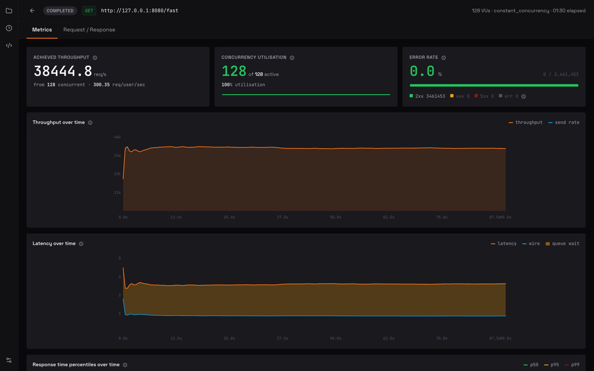

---
hide:
  - navigation
  - toc
---

# Vayu Documentation

Vayu is an open source desktop app that merges a REST/GraphQL request builder
with a native load tester. Everything runs on your machine: no account, no cloud
sync, no quotas.

It is built as a **sidecar**: an Electron + React UI (the manager) talks to a
C++20 daemon (the engine) over HTTP on `127.0.0.1:9876`. The split is what lets
the UI stay responsive while the engine saturates a target at tens of thousands
of requests per second.

[Read the architecture](architecture.md){ .md-button .md-button--primary }
[Engine HTTP API](engine/api-reference.md){ .md-button }
[Download](https://github.com/athrvk/vayu/releases/latest){ .md-button }

{ .shot }

- :material-sitemap: **[Architecture](architecture.md)**

    The sidecar pattern, process model, lifecycle, and IPC. Start here.

- :material-hammer-wrench: **[Building from Source](building.md)**

    Prerequisites, `build.py`, CMake presets, and platform quirks.

- :material-api: **[Engine HTTP API](engine/api-reference.md)**

    Every endpoint, payload, and status code the engine serves.

- :material-palette: **[Design System](design-system.md)**

    Tokens, elevation, typography, and the component patterns the UI is built on.

## Engine

The C++20 daemon: request execution, load generation, persistence, and scripting.

| Document | Covers |
|---|---|
| [Architecture](engine/architecture.md) | Core structure, thread pool, engine-side auth resolution |
| [HTTP API Reference](engine/api-reference.md) | All endpoints, payload shapes, status codes, deprecated aliases |
| [Scripting Runtime](engine/scripting.md) | The QuickJS sandbox, script globals, hooks, limits |
| [Database Schema](engine/db-schema.md) | SQLite tables and the JSON shapes stored in them |
| [CLI](engine/cli.md) | Flags and subcommands for running the engine standalone |
| [MCP Server](engine/mcp.md) | The MCP tool surface exposed to coding agents |
| [Benchmarks](engine/benchmarks.md) | RPS head-to-head against wrk and vegeta, with methodology |
| [Building the Engine](engine/building.md) | CMake presets and vcpkg dependencies |

## App

The Electron + React renderer: request builder, collections, dashboard, and the
client half of request composition.

| Document | Covers |
|---|---|
| [Architecture](app/architecture.md) | Renderer-side structural decisions |
| [Components](app/COMPONENTS.md) | The `modules/` + `components/` layout |
| [State Management](app/state-management.md) | Zustand stores, TanStack Query keys, cache policy |
| [API Integration](app/api-integration.md) | What the renderer sends the engine, and when |
| [Variable Resolution](app/variable-resolution.md) | How `{{variables}}` resolve, and scope precedence |
| [Postman API Compatibility](app/pm-api-compatibility.md) | Which `pm.*` APIs the runtime supports |
| [File Name Conventions](app/file-name-conventions.md) | Naming rules across the renderer |
| [Building the App](app/building.md) | App build steps and tooling |
| [Import Collections](app/import-collections/README.md) | The import pipeline, plus per-format mapping for Postman, Insomnia v4, OpenAPI 3.0, and Swagger 2.0 |

## Design notes

Longer-form rationale for decisions that are easy to misread from the code alone.

- [Request Storage](request-storage-design.md) - how requests are persisted.
- [Lock File Handling](lock-file-handling.md) - lock and concurrency behaviour.
- [Pending Backlog](plans/pending-backlog.md) - deferred work, and why it is deferred.

## Elsewhere

- [Contributing Guide](https://github.com/athrvk/vayu/blob/master/CONTRIBUTING.md) - dev setup, code style, PR process, releases.
- [Security Policy](https://github.com/athrvk/vayu/blob/master/SECURITY.md) - threat model and reporting.
- [Releases](https://github.com/athrvk/vayu/releases/latest) - installers for Windows, macOS, and Linux.

!!! note "Licensing"

    The engine is AGPL-3.0 and the app is Apache-2.0. See
    [LICENSE](https://github.com/athrvk/vayu/blob/master/LICENSE) for both texts.
