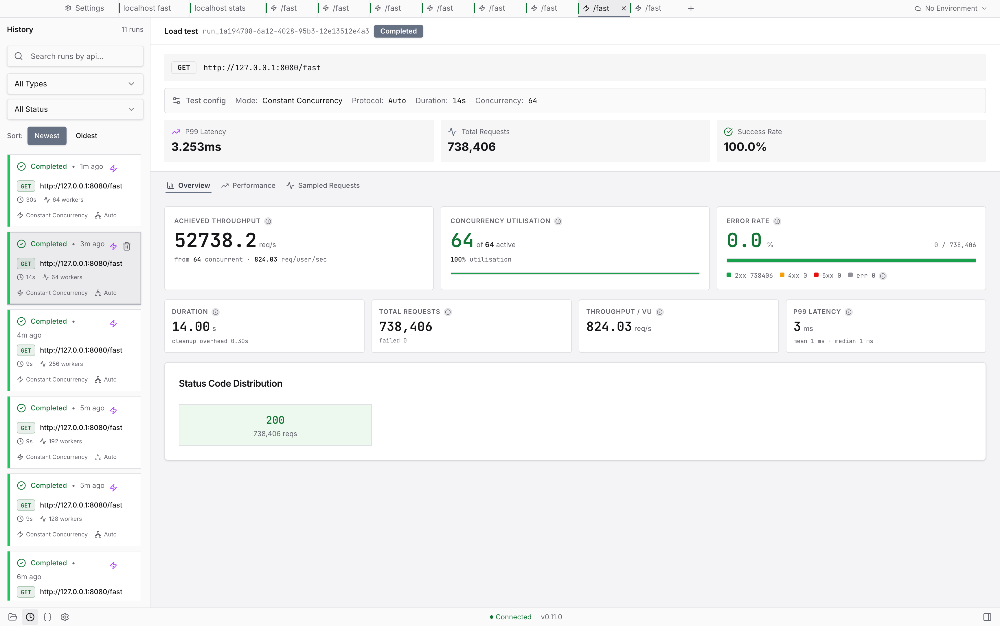

# Build the request. Load test it. Let your agent drive.

**Vayu** is a free, open source **API client for REST and GraphQL** with a
**native C++ load tester** built in - and an **MCP server** that hands the whole
engine to Claude Code, Cursor, VS Code, or Codex. One app instead of three, all
of it on your machine: no account, no cloud sync, no telemetry.

[Download Vayu](#install){ .md-button .md-button--primary }
[Use it from your agent](#drive-vayu-from-your-coding-agent){ .md-button }
[See what it does](#what-you-can-do){ .md-button }

Coming from another tool? Read the honest comparison:
[Postman](compare/vayu-vs-postman.md) &middot;
[Bruno](compare/vayu-vs-bruno.md) &middot;
[k6](compare/vayu-vs-k6.md) &middot;
[JMeter](compare/vayu-vs-jmeter.md)

{ .shot }

## Install

Windows (x64), macOS (universal), and Linux (AppImage). No account, no sign-in.

<!-- This section is the canonical install copy (flipped from README.md in #631).
     The README carries the three one-liners only and links back here for the
     detail, so per-platform wording is added and corrected here first - both
     point at the same release assets and install.sh.

     The macOS URL is this site serving the repo's own install.sh, published at
     the site root by .github/hooks/install_script.py. It is a real file, not a
     redirect, so it only refreshes when this site deploys - which is why
     workflows/docs.yml watches install.sh too. -->

=== "macOS"

    ```sh
    bash -c "$(curl -fsSL https://athrvk.github.io/vayu/install.sh)"
    ```

    Installs the latest release to `/Applications`, and asks for your password
    once. Vayu ships unsigned, so the script ad-hoc signs the app and clears the
    quarantine flag - without that, macOS reports it as damaged.

    **Updating is the same command.** It keeps your collections and settings,
    offers to quit Vayu if it is running (and reopens it after), and does
    nothing if you already have the latest version - `--force` reinstalls
    anyway.

    Pin a version with `VAYU_VERSION=0.2.1` in front of the command, or
    uninstall by re-running it with `-- --uninstall`.

=== "Windows"

    ```powershell
    winget install athrvk.Vayu
    ```

    Installs the latest release with
    [winget](https://learn.microsoft.com/windows/package-manager/winget/).

    Or download the installer directly:

    1. Download [**Vayu-x64.exe**](https://github.com/athrvk/vayu/releases/latest/download/Vayu-x64.exe).
    2. Run the installer and follow the wizard.
    3. Launch **Vayu** from the Start menu.

=== "Linux"

    ```sh
    bash -c "$(curl -fsSL https://athrvk.github.io/vayu/install.sh)"
    ```

    The same command as macOS. It installs the AppImage under
    `~/.local/share/vayu` and registers a launcher entry, so Vayu shows up in
    your applications menu. Nothing it writes leaves your home directory, so it
    never asks for root. Re-run it to update. x86_64 only.

    Or take the AppImage from the
    [latest release](https://github.com/athrvk/vayu/releases/latest) and run it
    yourself - it is self-contained either way.

    If it does not start, your system is probably missing FUSE 2:
    `sudo apt install libfuse2`, or run it once with
    `APPIMAGE_EXTRACT_AND_RUN=1`.

[All releases](https://github.com/athrvk/vayu/releases){ .md-button }
[Build from source instead](building.md){ .md-button }

## What you can do

### Build and test

<div class="grid cards" markdown>

- :material-swap-horizontal: **Send REST and GraphQL requests**

    Every method, and JSON, XML, JSON-RPC, form-data, URL-encoded, raw, or
    GraphQL bodies. Collections nest, with their own variables, auth, and
    scripts.

- :material-import: **Bring what you already have**

    Drop in a Postman, Insomnia, OpenAPI or Swagger export and keep your folders,
    variables, auth and scripts. [What carries over](#bring-your-existing-collections).

- :material-code-braces: **Keep your Postman tests**

    A QuickJS runtime implements `pm.test()`, `pm.expect()`,
    `pm.environment.set()` and `pm.response.*`, so most scripts run unmodified.

- :material-key-variant: **Auth that inherits**

    Bearer, Basic, API key, and OAuth 2.0 (client credentials, password,
    authorization code + PKCE) - resolved engine-side, inherited down the tree.

- :material-broadcast: **Watch a stream as it arrives**

    `text/event-stream` is a first-class request type: events land in a live
    Events view, you can stop the stream, scripts assert on it afterwards, and
    the list comes back when you reopen the run.

- :material-magnify: **Find anything, by what is inside it**

    One shortcut opens a command palette over every collection, request,
    environment and setting - searching their contents, not just their names.

</div>

### Under load, and beyond

<div class="grid cards" markdown>

- :material-speedometer: **Load test without a second tool**

    A multi-worker C++ event loop drives the load and streams throughput,
    latency percentiles, and error counts live. See the
    [benchmarks](engine/benchmarks.md) against wrk and vegeta.

- :material-table-arrow-right: **Drive a run from a data file**

    Point a collection at a CSV, TSV, JSON or JSONL file and each iteration gets
    its own row, as `{{data.column}}` tokens and `pm.iterationData`.
    [Data-driven runs](app/data-driven-runs.md).

- :material-server-network: **Mock what is not built yet**

    Serve a collection's saved examples as a live mock, with a mock OAuth issuer
    for auth flows and a webhook inbox that captures what a third party sends
    you.

- :material-robot-outline: **Hand it to your coding agent**

    A built-in MCP server exposes the engine to Claude Code, Cursor, VS Code,
    Codex and Zed - behind a host allowlist and load caps you set.
    [Drive Vayu from your agent](#drive-vayu-from-your-coding-agent).

- :material-shield-lock-outline: **Private by default**

    100% offline execution. No telemetry, no account, no cloud sync - your
    requests and secrets never leave the machine.

</div>

## Bring your existing collections

Switching tools is only cheap if your work comes with you. Drop in an export -
the format is detected for you, no "which importer?" dialog - and Vayu rebuilds
the tree, variables, auth and scripts.

=== "Postman"

    **v2.1 and v2.0 exports.** The folder tree, collection and folder variables,
    auth (Bearer, Basic, API key, OAuth 2.0), pre-request and test scripts, query
    parameters including disabled ones and their descriptions, and raw, JSON,
    URL-encoded, form-data and GraphQL bodies.

    **Environments** come across too. Postman exports those as separate files -
    drop one in and it imports as a Vayu environment, keys, values, enabled state
    and secret flag intact. A **globals** export imports the same way, merging
    into Vayu's globals scope rather than creating an environment; variables you
    already had are kept, and a name that clashes is overwritten.

    Binary and file bodies are dropped and reported with a count rather than
    silently, and Digest / AWS / NTLM auth imports as data but will not execute.

=== "Insomnia"

    **Export v4.** Vayu rebuilds the workspace, folder and request tree from
    Insomnia's flat resource list, and workspace **environments do come across**.

    `{{var}}` templates are converted to Vayu's own. Nunjucks tags (``)
    and filtered expressions (`{{ x | filter }}`) are left verbatim as text, since
    Vayu has no equivalent - they stay visible instead of silently breaking.

=== "OpenAPI & Swagger"

    **OpenAPI 3.0 and Swagger 2.0**, JSON or YAML. A spec describes endpoints
    rather than recording requests, so Vayu generates **stubs**: one collection
    per tag, a `{{baseUrl}}` variable from the server definition, parameters with
    empty values, and a request body sampled from the schema. Auth schemes map
    across, seeded with `{{variables}}` for you to fill in.

[How import works, format by format](app/import-collections/README.md){ .md-button }

## How it fits together

Vayu is a **sidecar**: the Electron + React UI talks to a C++20 daemon over HTTP
on `127.0.0.1:9876`. That split is why the interface stays responsive while the
engine saturates a target - and why the engine can be driven on its own, from the
[command line](engine/cli.md) or by a coding agent over
[MCP](engine/mcp.md).

[How it works in full](architecture.md){ .md-button }

## Drive Vayu from your coding agent

Vayu ships an **MCP server**, so an agent can use the same engine the UI does -
send a request, start a load run, read the report, compare two runs. It runs
inside the app on `127.0.0.1:9877`, proxying the engine's REST API; there is no
second process to manage, and nothing leaves the machine.

=== "Claude Code"

    ```bash
    claude mcp add --transport http vayu http://127.0.0.1:9877/mcp
    ```

    Or click **Connect** in **Settings → MCP**, which shells out to the CLI for
    you.

=== "Cursor"

    ```json
    // .cursor/mcp.json
    {
      "mcpServers": {
        "vayu": { "type": "http", "url": "http://127.0.0.1:9877/mcp" }
      }
    }
    ```

=== "VS Code"

    ```json
    // .vscode/mcp.json - note the "servers" key, not "mcpServers"
    {
      "servers": { "vayu": { "type": "http", "url": "http://127.0.0.1:9877/mcp" } }
    }
    ```

=== "Codex"

    ```toml
    # ~/.codex/config.toml
    [mcp_servers.vayu]
    url = "http://127.0.0.1:9877/mcp"
    ```

**24 tools, 5 resources, 4 prompts.** Inspection (`list_collections`,
`get_run_report`, `compare_runs`), execution (`run_request`,
`run_collection_smoke`), load (`start_load_run`, `stop_run`), and writes
(full CRUD over collections and saved requests, plus `update_environment`) -
each with a typed schema, so the agent gets validation rather than guesswork.

**An agent pointed at your engine is a real capability, so it is gated.** Tools
that touch the network refuse any host outside an **allowlist that starts empty**
(deny all). Load runs are additionally capped on RPS, concurrency and duration,
and require confirmation. The tools that mutate saved data sit behind a **write
toggle that is off by default**. All of it lives in **Settings → MCP** and
persists.

[MCP reference](engine/mcp.md){ .md-button }

## Reference

**Engine** - the C++20 daemon: execution, load generation, persistence, scripting.

| Document | Covers |
|---|---|
| [Overview](engine/architecture.md) | Core structure, thread pool, engine-side auth resolution |
| [HTTP API](engine/api-reference.md) | Every endpoint, payload shape, and status code |
| [Test Scripting](engine/scripting.md) | The QuickJS sandbox, script globals, hooks, limits |
| [Local Database](engine/db-schema.md) | SQLite tables and the JSON shapes stored in them |
| [Command Line](engine/cli.md) | Flags and subcommands for running the engine standalone |
| [MCP Server](engine/mcp.md) | The tool surface exposed to coding agents |
| [Benchmarks](engine/benchmarks.md) | RPS head-to-head against wrk and vegeta, with methodology |

**Desktop app** - the Electron + React renderer.

| Document | Covers |
|---|---|
| [Overview](app/architecture.md) | Renderer-side structural decisions |
| [UI Components](app/COMPONENTS.md) | The `modules/` + `components/` layout |
| [Design System](design-system.md) | Tokens, elevation, typography, component patterns |
| [State Management](app/state-management.md) | Zustand stores, TanStack Query keys, cache policy |
| [Talking to the Engine](app/api-integration.md) | What the renderer sends the engine, and when |
| [Variables](app/variable-resolution.md) | How `{{variables}}` resolve, and scope precedence |
| [Postman Script Support](app/pm-api-compatibility.md) | Which `pm.*` APIs the runtime supports |
| [File Naming](app/file-name-conventions.md) | Naming rules across the renderer |
| [Importing Collections](app/import-collections/README.md) | The import pipeline, plus per-format mapping |

**Design notes** - rationale that is easy to misread from the code alone:
[Request Storage](request-storage-design.md),
[Lock Files](lock-file-handling.md),
[Deferred Work](plans/pending-backlog.md).

## Questions people ask

??? question "Is Vayu free?"

    Yes - fully free and open source, with no paid tier, no subscription, and no
    feature gating. The engine is AGPL-3.0 and the app is Apache-2.0.

??? question "How is it different from Postman, Bruno, or Insomnia?"

    Those are good API clients, but none of them load test - for that you reach
    for k6 or JMeter as a second tool. Vayu does both in one app: build the
    request, then load test that same endpoint with a native C++ engine.
    Side by side, with what each one does better:
    [vs Postman](compare/vayu-vs-postman.md),
    [vs Bruno](compare/vayu-vs-bruno.md),
    [vs k6](compare/vayu-vs-k6.md),
    [vs JMeter](compare/vayu-vs-jmeter.md).

??? question "Does Vayu support SSE / streaming endpoints?"

    Yes - server-sent events are a first-class request type. Turn on Event
    stream and `text/event-stream` responses arrive in a live Events tab as they
    stream, with a Stop control, scripts that assert on the buffered events once
    it closes, and the event list restored when you reopen the run from history.
    Streams stay bounded under load rather than buffering without limit.

??? question "Can I import my Postman collections?"

    Yes - v2.0 and v2.1 exports, including folders, collection variables, auth,
    and pre/post-request scripts. Postman environments are a separate export;
    import that file too and it becomes a Vayu environment, and a globals export
    merges into Vayu's globals scope. Insomnia v4,
    OpenAPI 3.0 and Swagger 2.0 import too; see
    [what carries over](#bring-your-existing-collections).

??? question "Will my Postman test scripts still run?"

    Most run unmodified. A QuickJS runtime implements the `pm.*` API -
    `pm.test()`, `pm.expect()`, `pm.environment.get/set()`, `pm.response.*` -
    and [Postman Script Support](app/pm-api-compatibility.md) lists exactly
    what is covered.

??? question "Can my coding agent use it?"

    Yes - Vayu hosts an MCP server on `127.0.0.1:9877` and one command registers
    it with Claude Code, Cursor, VS Code, Codex or Zed. The agent gets 24 tools
    across inspection, execution, load runs and writes, behind a host allowlist,
    load caps, and a write toggle that ships off. See the
    [MCP reference](engine/mcp.md).

??? question "Does it work offline, and does it need an account?"

    Offline, and no account. All execution is local; Vayu contacts no external
    server during normal use - no telemetry, no license check, no cloud sync.

??? question "How fast is the load testing, really?"

    On a laptop against a loopback target, the engine matches
    [wrk](https://github.com/wg/wrk) (56,880 vs 54,280 req/s measured in the same
    session) and edges past [vegeta](https://github.com/tsenart/vegeta), with all
    three converging on the same ~57k system throughput ceiling. Driven from the
    app's own UI, a 60-second run sustained 51,922 req/s and 3.1 M requests with
    zero errors. Full method, concurrency sweep, and a one-command reproduction
    are in the [benchmarks](engine/benchmarks.md).

??? question "Which platforms are supported?"

    Windows (x64), macOS (Apple Silicon and Intel, universal), and Linux
    (x86_64 AppImage).

## Contribute

Bug reports, feature ideas, docs, and code are all welcome. The
[Contributing Guide](https://github.com/athrvk/vayu/blob/master/CONTRIBUTING.md)
covers dev setup, code style, testing, and the release process;
[Build from Source](building.md) gets the engine and app compiling locally.

!!! note "Licensing"

    The engine is AGPL-3.0 and the app is Apache-2.0. See
    [LICENSE](https://github.com/athrvk/vayu/blob/master/LICENSE) for both texts,
    and the [Security Policy](https://github.com/athrvk/vayu/blob/master/SECURITY.md)
    for the threat model and how to report an issue.
